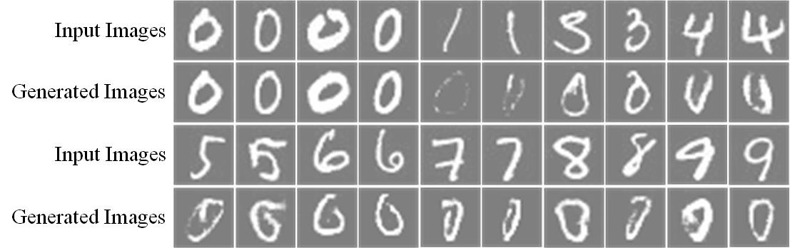

# WGAN-GP for Unsurpevised Anomaly Detection in PyTorch

This is the PyTorch implementation for unsurpevised anomaly detection.

The code was written by [Xi Ouyang](https://github.com/oyxhust).

This is a reimplementation of the paper ['Unsupervised Anomaly Detection with Generative Adversarial Networks to Guide Marker Discovery'](https://arxiv.org/abs/1703.05921). This paper demontrate a novel application of GAN, which is used for unsurpevised anomaly detection. GAN is only trained on the normal data distrubution without adding any anomaly data, and can be used to detect the anomaly directly. Since this paper does not pulish their code, I implement this paper based on PyTorch. In this project, I use the wgan-gp loss for the GAN model while in the paper they use the normal DCGAN.

## Prerequisites
- Linux or macOS
- Python 2 or 3
- CPU or NVIDIA GPU + CUDA CuDNN

## Getting Started
### Installation
- Install PyTorch and dependencies from http://pytorch.org
- Install Torch vision from the source.
```bash
git clone https://github.com/pytorch/vision
cd vision
python setup.py install
```
- Install python libraries [visdom](https://github.com/facebookresearch/visdom) and [dominate](https://github.com/Knio/dominate).
```bash
pip install visdom
pip install dominate
```
- Clone this repo:
```bash
git clone https://github.com/oyxhust/wgan-gp-anomaly
cd wgan-gp-anomaly
```

### MNIST train/test
Due to can not access to the data used in the paper, I conduct the experiment on the MNIST dataset. For example, the GAN model can be trained on all "0" images in MNIST then testing this model with the "0-9" images. The "1-9" images can be regarded as the abnormal images.
- Prepare for the MNIST dataset:
download the MNIST dataset [here](http://yann.lecun.com/exdb/mnist/) into '/datasets/MNIST' (all the four gz files).
```bash
cd datasets/MNIST
python unpack_mnist.py
```
create two new folders 'train' and 'test', and put the one-class images into train. In my testing, I put the "0" image in training set into the 'train' folder. Also, I select 30 images from each class in testing set into 'test' folder.

Or you can directly use my data for training:
```bash
tar zxvf data.tar.gz
```

- Train a model:
under the main folder:
```bash
python train.py --dataroot ./datasets/MNIST --name mnist --no_flip
```
- To view training results and loss plots, run `python -m visdom.server` and click the URL http://localhost:8097. To see more intermediate results, check out `./checkpoints/mnist/web/index.html`
- Test the model:
```bash
python test.py --dataroot ./datasets/MNIST --name mnist --how_many 300
```
The test results will be saved to a html file here: `./results/mnist/latest_test`. The 'images' folder saves the input testing images and the corresponding normal images generated by the GAN. The 'Testing_models' folder saves the input noises contained in the Generator models. Also, the testing result can see in the URL http://localhost:8097. It can be seen that the generated images become similar to the input images smoothly. The parameter 'how_many' controls the number of testing images.

## Results
I train the GAN using "0" images and test it on the all classes images. Here are the visual results:


The GAN can only generate "0" images which refer to the normal situations. When input the abnormal images (like "1", "8" and so on), the GAN will output the similar corresponding "0" images.

## Acknowledgments
Code is inspired by [pytorch-CycleGAN-and-pix2pix](https://github.com/junyanz/pytorch-CycleGAN-and-pix2pix) and [wgan-gp](https://github.com/caogang/wgan-gp).
